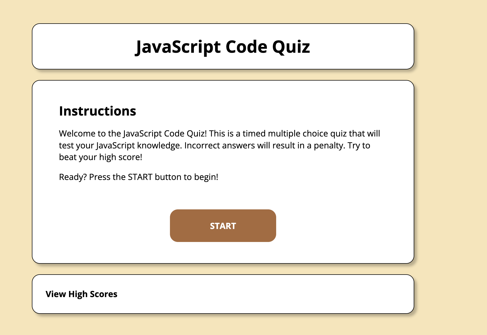

# JavaScript Code Quiz

## Purpose
The JavaScript Code Quiz is an interactive quiz designed to test the user's knowledge of JavaScript topics. Users can take the quiz and see how well they perform against a countdown timer. The quiz provides feedback for correct and incorrect answers and saves user scores in a table of high scores.

## Contents
1. [Features](#features)
2. [Web Page](#web-page)
3. [Task List](#task-list)
4. [Contribution](#contribution)

## Features
* Users are first presented with an instruction screen, which explains the quiz rules and objectives.
* Initiating the quiz will start a countdown timer, acting as the user's score.
* Incorrect answers result in a deduction from the timer, adding an element of challenge and urgency.
* Feedback is provided for both correct and incorrect answers, allowing users to learn from their mistakes.
* User scores are saved and displayed in a table of high scores, enabling players to track their progress and compete with others.

## Web Page

[Deployed JavaScript Code Quiz](https://jtecson85.github.io/Web-API-Code-Quizzie/)

## Task List
- [ ] Add more questions.
- [x] Add media query optimization.
- [ ] Refactor code.
- [x] Improve README.md.

## Contribution
- Starter code provided by [UCB Coding Boot Camp]
